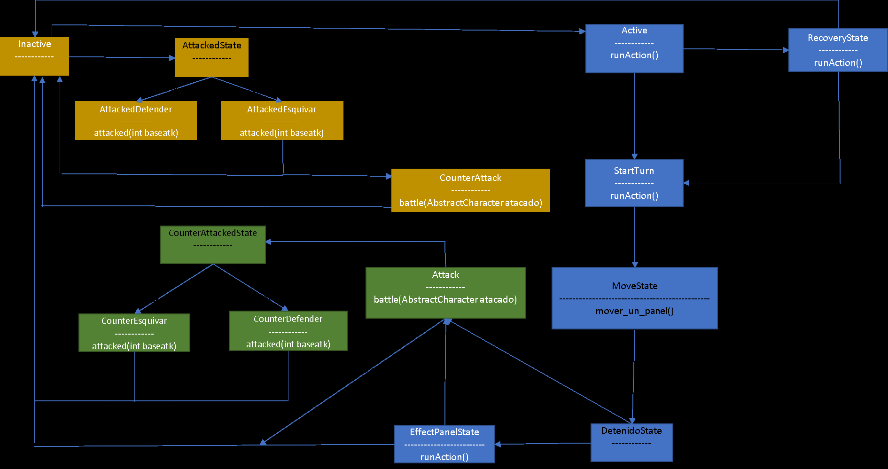

**README GENERAL**
--------------------------------
Como son muchas cosas en esta tarea, decidí hacer varios readme donde creo que puede
ser necesario explicar algo. Estos se encuentran en la carpeta donde explica un poco el código 
y lo justifican. A continuación se hablará en términos generales sobre las carpetas:
* Controller: En esta carpeta se encuentra el controlador del juego, su readme. Se usó
el patrón de diseño observer.
* exeption: Se usaron exepciones para los estados. En esta carpeta se creó.
* main: Corresponde a un ejemplo de juego completo. Más detalles en readme de controller.
como es un ejemplo, no lo consideré para coverage y no fue testeado.
* paneles: Tiene readme propio. Se hizo un pequeño cambio en paneles boss y encounter.
* personaje: Tiene readme propio. Se explican modificaciones para implementar el patrón de 
diseño state.
* state: Se implementa el patrón de diseño state. Se usan exepciones para manejar transiciones a estados 
no permitidas. El contexto corresponde a los character. A continuación una imagen
que representa esto: (La imagen fue entregada también por u-cursos)

Gracias por revisar, buenas vacaciones c: